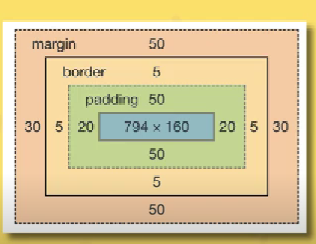
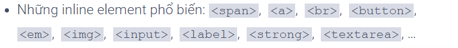
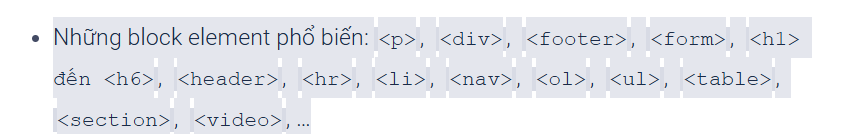

# 15_08_2024 Css(Cascading Style Sheets)

## Đĩnh nghĩa

Css dùng để tạo trang web là ngôn ngữ tạo phong cách và tạo kiểu cho những yếu tố viết dạng ngôn ngữ văn bản, như HTML

Có 3 cách liên kêt css với html:

### Có 3 cách liên kết CSS với HTML:

1. **Inline CSS**:  
   CSS được viết trực tiếp bên trong thẻ HTML bằng thuộc tính `style`.

   ```html
   <p style="color: blue; font-size: 16px;">
     Đoạn văn này có màu xanh và kích thước font là 16px.
   </p>
   ```

2. **Internal CSS**:  
    CSS được viết trực tiếp bên trong thẻ HTML bằng thuộc tính `style`.

   ```html
   <html>
     <head>
       <style>
         div {
           /* color: red; */
           /* font-size: 20px; */
         }
       </style>
     </head>
     <body>
       <p>Đoạn văn này có màu đỏ và kích thước font là 20px.</p>
     </body>
   </html>
   ```

3. **External CSS**:
   External: Dùng thẻ link liên kết đến trang css , trang css naằ ngoiaf html`style`.

```html
<html>
  <head>
    <link rel="stylesheet" href="styles.css" />
  </head>
  <body>
    <p>Đoạn văn này có màu đỏ và kích thước font là 20px.</p>
  </body>
</html>
```

## **1. CSS Selector:**

- Là thứ cho phép nhắm mục tiêu tới phần tử HTML để áp dụng CSS.
- Giống đường dẫn, chỉ định các phần tử HTML nào đang cần điều chỉnh, tạo kiểu CSS.

## **2. CSS Variables:**

- Khai báo biến `var(--name, value)`
- Hàm **`var()`** được sử dụng để chèn giá trị vào biến.

## **3. ID và CLASS: (#id{css}), (.class{css})**

- Về cơ bản **ID** và **Class** đều giống nhau, đều được dùng để phân biệt, định dạng các thẻ và khai báo trong **CSS**.
- Sự khác nhau là khi khai báo id cho một thẻ nào đó thì tên **id đó không được dùng lại nữa**, tức là không được khai báo tên đó cho thẻ khác. Còn **Class** thì khai báo 1 lớp các thẻ và chúng sẽ có **cùng chung thuộc tính trong CSS.**

## **4. Priority level (mức độ ưu tiên):**

1. **Internal & External:** (không có mức độ ưu tiên cái nào dùng sau thì sẽ mới hơn)
2. **Sắp xếp theo thứ tự ưu tiên từ cao → thấp:**
   1. **inline - 1000**
   2. **#id - 100**
   3. **.class - 10**
   4. **.tag - 1**
3. **Equal specificity:**
   1. Có 2 hoặc nhiều quy tắc CSS trỏ đến cùng 1 phần tử, bộ chọn có giá trị đặc hiệu cao nhất sẽ ưu tiên.
4. **Universal selector and inherited:**

   - Universal selector: một CSS chung cho tất cả các element.
     - Ví dụ:
       ```css
       * {
         background-color: yellow;
       }
       ```
   - Inherited (kế thừa):
     - Ví dụ:
       ```css
       html {
         background-color: yellow;
       }
       ```

5. **!important: Đặc biệt ưu tiên.**

## **5. Box Model:**

- Là khoảng không gian phần tử chiếm trong trang web:

  - **Content:** nội dung của hộp.
  - **Padding:** lớp đệm bao quanh content.
  - **Border:** đường viền bao quanh phần đệm.
  - **Margin:** Lề bao quanh tất cả.



## **6. CSS Layout:**

- **Display: inline | block | inline-block**

  - **Inline:** các item sẽ nằm trên cùng một dòng, nếu vượt quá độ dài sẽ xuống dòng, không set được width, height và chỉ set được padding, margin left và right.
    

  - **Block:** các item sẽ luôn xuống dòng và set được width, height, padding, margin đầy đủ 4 hướng.
    
  - **Inline-block:** items giống inline và thuộc tính giống block.

## **7. CSS Position:**

- **Relative:**
  - Vị trí tương đối không phụ thuộc vào vị trí nào cả và sẽ di chuyển vị trí với các thuộc tính `top, left, right, bottom`.
- **Absolute:**
  - Vị trí tuyệt đối phụ thuộc vào thẻ cha gần nhất có thuộc tính `position` để lấy làm gốc tọa độ.
- **Fixed:**
  - Vị trí cố định, định vị tương ứng với khung nhìn, luôn ở cùng một vị trí ngay cả khi trang cuộn.
- **Sticky (ít dùng):**
  - Vị trí bám dính.

## **8. CSS FlexBox** ❗

- Các thuộc tính sử dụng với flex container:
  - **Flex: 1** (là thuộc tính cho thẻ con chiếm hết không gian của thẻ cha).
  - **Flex-direction:** dùng để chỉ định hướng các items.
    - _Row_: giá trị mặc định được xếp từ trái → phải.
    - _Row-reverse_: ngược lại với row.
    - _Column_: các item được xếp theo hàng dọc.
    - _Column-reverse_: ngược lại với column.
  - **Flex-wrap:** dùng để kiểm soát việc **bọc** các items trong container.
    - _Nowrap_: mặc định.
    - _Wrap_: các items được bọc gọn trong container.
    - _Wrap-reverse_: ngược lại với wrap.
  - **Flex-flow:** giá trị đầu tiên là flex-direction, giá trị thứ hai là flex-wrap.
  - **Justify-content:** dùng để căn chỉnh vị trí của các items theo chiều ngang (main axis).
    - _Flex-start_: đặt items ở đầu từ main start (giá trị mặc định).
    - _Flex-end_: đặt items ở cuối từ main end.
    - _Center_: sẽ đặt items ở giữa trục main axis.
    - _Space-between_: chia đều khoảng cách giữa các items.
    - _Space-around_: chia khoảng cách ở đầu và cuối.
    - _Space-evenly_: chia đều khoảng cách giữa các items với items, và giữa items với main start và main end.
  - **Justify-self:** dùng cho các item con nếu cha không có thuộc tính **`Justify-content`**, và ngược lại nếu cha có thì con không cần phải dùng.
    - Các thuộc tính `Flex-start | Flex-end | Center` tương tự **`Justify-content`**.
  - **Align-items:**
    - _Stretch_: chiều dài items = chiều dài cross axis.
    - _Flex-start_: items đặt ở điểm bắt đầu main cross start (trên cùng bên trái) và kích thước không thay đổi.
    - _Flex-end_: items đặt ở cross end (dưới cùng bên trái).
    - _Center_: items đặt ở giữa cross start và cross end.
    - _Baseline_: căn chỉnh theo dòng văn bản của các items.
  - **Align-content:** tương tự _justify-content_, nhưng căn theo trục dọc (cross axis).

## **9. CSS Grid Layout** ❗

- **Grid-template-rows** và **Grid-template-columns**: Dùng để định nghĩa số lượng và kích thước của các hàng và cột trong grid container.

  - _Ví dụ_: `grid-template-rows: 100px 200px;` tạo ra 2 hàng với chiều cao lần lượt là 100px và 200px.
  - _Ví dụ_: `grid-template-columns: 1fr 2fr;` tạo ra 2 cột với cột đầu tiên chiếm 1 phần và cột thứ hai chiếm 2 phần không gian.

- **Grid-template-areas**: Dùng để định nghĩa bố cục các vùng trong grid container.

  - _Ví dụ_:
    ```css
    grid-template-areas:
      "header header header"
      "sidebar main main"
      "footer footer footer";
    ```

- **Grid-area**: Dùng để xác định vị trí của các item trong grid layout dựa trên các vùng đã định nghĩa.

  - _Ví dụ_: `grid-area: header;` để đặt item vào vùng `header` đã định nghĩa trong `grid-template-areas`.

- **Grid-column** và **Grid-row**: Dùng để xác định vị trí của item trong grid container.

  - **Grid-column**: Xác định vị trí bắt đầu và kết thúc của item trong các cột.
    - _Ví dụ_: `grid-column: 1 / 3;` để item chiếm từ cột thứ 1 đến cột thứ 3.
  - **Grid-row**: Xác định vị trí bắt đầu và kết thúc của item trong các hàng.
    - _Ví dụ_: `grid-row: 2 / 4;` để item chiếm từ hàng thứ 2 đến hàng thứ 4.

- **Grid-gap**: Dùng để xác định khoảng cách giữa các hàng và cột trong grid container.

  - _Ví dụ_: `grid-gap: 10px;` tạo khoảng cách 10px giữa các hàng và cột.

- **Grid-auto-rows** và **Grid-auto-columns**: Dùng để xác định kích thước của các hàng và cột tự động khi không được định nghĩa rõ ràng trong `grid-template-rows` và `grid-template-columns`.

  - _Ví dụ_: `grid-auto-rows: 100px;` để các hàng tự động có chiều cao 100px.

- **Grid-auto-flow**: Dùng để xác định cách mà các item được đặt vào các ô còn trống trong grid container.

  - _Row_: (mặc định) các item được đặt từ trái sang phải và từ trên xuống dưới.
  - _Column_: các item được đặt từ trên xuống dưới và từ trái sang phải.
  - _Dense_: các item được đặt vào các ô trống nhỏ hơn để làm đầy không gian trống.

- **Align-items**: Dùng để căn chỉnh các item theo chiều dọc trong grid container.

  - _Start_: căn chỉnh các item ở đầu của trục cross (trên cùng).
  - _End_: căn chỉnh các item ở cuối của trục cross (dưới cùng).
  - _Center_: căn chỉnh các item ở giữa của trục cross.
  - _Stretch_: kéo dài các item để lấp đầy không gian của trục cross.

- **Align-content**: Tương tự như `align-items`, nhưng dùng để căn chỉnh các hàng trong grid container theo chiều dọc.

  - _Start_: căn chỉnh các hàng ở đầu của trục cross.
  - _End_: căn chỉnh các hàng ở cuối của trục cross.
  - _Center_: căn chỉnh các hàng ở giữa của trục cross.
  - _Stretch_: kéo dài các hàng để lấp đầy không gian của trục cross.
  - _Space-between_: chia đều khoảng cách giữa các hàng.
  - _Space-around_: chia đều khoảng cách giữa các hàng và các cạnh của grid container.
  - _Space-evenly_: chia đều khoảng cách giữa các hàng, giữa các hàng và các cạnh của grid container.

- **Justify-items**: Dùng để căn chỉnh các item theo chiều ngang trong grid container.

  - _Start_: căn chỉnh các item ở đầu của trục main (bên trái).
  - _End_: căn chỉnh các item ở cuối của trục main (bên phải).
  - _Center_: căn chỉnh các item ở giữa của trục main.
  - _Stretch_: kéo dài các item để lấp đầy không gian của trục main.

- **Justify-content**: Dùng để căn chỉnh các hàng trong grid container theo chiều ngang (trục main).
  - _Start_: căn chỉnh các hàng ở đầu của trục main.
  - _End_: căn chỉnh các hàng ở cuối của trục main.
  - _Center_: căn chỉnh các hàng ở giữa của trục main.
  - _Space-between_: chia đều khoảng cách giữa các hàng.
  - _Space-around_: chia đều khoảng cách giữa các hàng và các cạnh của grid container.
  - _Space-evenly_: chia đều khoảng cách giữa các hàng và các cạnh của grid container.

## **10. Responsive Web Design** ❗

Responsive Web Design (RWD) là một kỹ thuật thiết kế web nhằm đảm bảo rằng các trang web hoạt động và hiển thị tốt trên nhiều loại thiết bị và kích thước màn hình khác nhau, từ máy tính để bàn đến điện thoại di động. Đây là cách để làm cho trang web linh hoạt và có thể thích ứng với các kích thước màn hình khác nhau.

### 1. **Media Queries**

Media Queries là phần quan trọng trong CSS để áp dụng các kiểu dáng khác nhau cho các kích thước màn hình khác nhau.

**Cú pháp:**

```css
@media (condition) {
  /* CSS styles */
}
```
