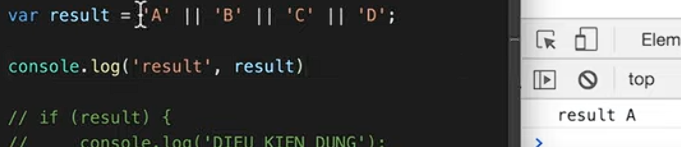
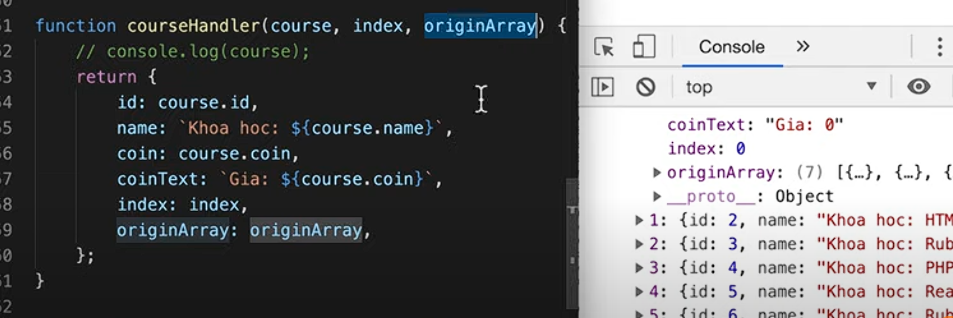

# 20_08_2024 JavaScript

## Đĩnh nghĩa

JavaScript để lập trình hành vi của các trang web.

### Có 3 cách liên kết JavaScript với HTML:

1. **Inline JS**:  
   JS được viết trực tiếp bên trong thẻ HTML bằng thuộc tính `style`.

```html
<!DOCTYPE html>
<html lang="en">
  <head>
    <meta charset="UTF-8" />
    <meta name="viewport" content="width=device-width, initial-scale=1.0" />
    <title>Internal JavaScript</title>
  </head>
  <body>
    <button onclick="alert('Hello, World!')">Click Me!</button>
  </body>
</html>
```

2. **Internal JS**:  
   JS được viết trực tiếp bên trong thẻ HTML bằng thuộc tính `style`.

```html
<html>
  <head>
    <script>
      function showAlert() {
        alert("This is an internal script!");
      }
    </script>
  </head>
  <body>
    <button onclick="showAlert()">Click Me!</button>
  </body>
</html>
```

2. **External JS**:  
   External: Dùng thẻ link liên kết đến trang JS , trang JS naằ ngoiaf html`JS`.

```html
<!DOCTYPE html>
<html lang="en">
  <head>
    <meta charset="UTF-8" />
    <meta name="viewport" content="width=device-width, initial-scale=1.0" />
    <title>External JavaScript</title>
    <script src="script.js"></script>
  </head>
  <body>
    <button onclick="showMessage()">Click Me!</button>
  </body>
</html>
```

### Biến JavaScript

Biến là Container để lưu trữ dữ liệu

1. **JavaScript Variables** có thể được khai báo theo 4 cách:

- Tự động
- Sử dụng `var`
- Sử dụng `let`
- Sử dụng `const`

#### Khi nào nên sử dụng `var`, `let`, hoặc `const`?

1. **Luôn khai báo các biến**:

2. **Luôn sử dụng `const` nếu không nên thay đổi giá trị**:

3. **Luôn sử dụng `const` nếu không nên thay đổi kiểu (Mảng và Đối tượng)**

4. **Chỉ sử dụng `var` nếu bạn không thể sử dụng `let` hoặc`const`**
5. **Chỉ sử dụng `var` nếu bạn PHẢI hỗ trợ các trình duyệt cũ**

### Cách đặt tên cho biến Trong JavaScript

Tất cả các biến trong JavaScript phải được xác định bằng những tên gọi duy nhất.

Những tên gọi duy nhất này được gọi là **định danh (identifiers)**.

Định danh có thể là những tên ngắn (như x và y) hoặc những tên mô tả hơn (như age, sum, totalVolume).

Các quy tắc chung để tạo tên cho biến (định danh duy nhất) là:

- Tên có thể chứa chữ cái, chữ số, dấu gạch dưới (\_), và dấu đô la ($).
- Tên phải bắt đầu bằng một chữ cái.
- Tên cũng có thể bắt đầu bằng $ và \_ (nhưng chúng tôi sẽ không sử dụng chúng trong hướng dẫn này).
- Tên phân biệt chữ hoa chữ thường (y và Y là hai biến khác nhau).
- Các từ được dự trữ (như từ khóa trong JavaScript) không thể được sử dụng làm tên.

### Các Hàm Tích Hợp Sẵn Trong JavaScript

1. **`alert()`**

   - **Mô Tả**: Hiển thị một hộp thoại thông báo với một thông điệp và một nút "OK".
   - **Cú Pháp**: `alert(message)`
   - **Tham Số**:
     - `message`: Chuỗi thông báo cần hiển thị.
   - **Ví Dụ**:
     ```javascript
     alert("Hello, world!");
     ```

2. **`console.log()`**

   - **Mô Tả**: Ghi một thông điệp vào bảng điều khiển (console) của trình duyệt, thường dùng để gỡ lỗi.
   - **Cú Pháp**: `console.log(message)`
   - **Tham Số**:
     - `message`: Thông điệp hoặc đối tượng cần ghi vào bảng điều khiển.
   - **Ví Dụ**:
     ```javascript
     console.log("This is a log message.");
     ```

3. **`confirm()`**

   - **Mô Tả**: Hiển thị một hộp thoại với thông điệp và hai nút "OK" và "Cancel". Trả về `true` nếu người dùng nhấn "OK", và `false` nếu người dùng nhấn "Cancel".
   - 
   - **Cú Pháp**: `confirm(message)`
   - **Tham Số**:
     - `message`: Chuỗi thông báo cần hiển thị.
   - **Ví Dụ**:
     ```javascript
     let result = confirm("Do you want to proceed?");
     console.log(result); // true hoặc false
     ```

4. **`prompt()`**

   - **Mô Tả**: Hiển thị một hộp thoại yêu cầu người dùng nhập thông tin. Trả về giá trị người dùng nhập vào hoặc `null` nếu người dùng nhấn "Cancel".
   - 
   - **Cú Pháp**: `prompt(message, defaultValue)`
   - **Tham Số**:
     - `message`: Chuỗi thông báo cần hiển thị.
     - `defaultValue` (tuỳ chọn): Giá trị mặc định hiển thị trong trường nhập.
   - **Ví Dụ**:
     ```javascript
     let name = prompt("What is your name?", "Guest");
     console.log(name); // Người dùng nhập vào hoặc "Guest" nếu không nhập gì
     ```

5. **`setTimeout()`**

   - **Mô Tả**: Đặt một hàm hoặc đoạn mã để thực thi sau một khoảng thời gian nhất định.
   - **Cú Pháp**: `setTimeout(callback, delay)`
   - **Tham Số**:
     - `callback`: Hàm hoặc đoạn mã cần thực thi.
     - `delay`: Thời gian trì hoãn trước khi thực thi, tính bằng mili giây.
   - **Ví Dụ**:
     ```javascript
     setTimeout(() => {
       console.log("This message is shown after 2 seconds.");
     }, 2000);
     ```

6. **`setInterval()`**
   - **Mô Tả**: Đặt một hàm hoặc đoạn mã để thực thi liên tục sau một khoảng thời gian nhất định.
   - **Cú Pháp**: `setInterval(callback, interval)`
   - **Tham Số**:
     - `callback`: Hàm hoặc đoạn mã cần thực thi.
     - `interval`: Thời gian giữa các lần thực thi, tính bằng mili giây.
   - **Ví Dụ**:
     ```javascript
     let count = 0;
     let intervalId = setInterval(() => {
       count++;
       console.log("Interval executed: " + count);
       if (count >= 5) {
         clearInterval(intervalId);
       }
     }, 1000);
     ```

### Toán tử trong JavaScript

JavaScript hỗ trợ nhiều loại toán tử khác nhau. Dưới đây là các loại toán tử phổ biến:

##### Phân biệt Prefix và Postfix trong `++a` và `a++`

Toán tử tăng (`++`) trong JavaScript có hai cách sử dụng: **Prefix** và **Postfix**. Dưới đây là sự khác biệt giữa chúng.

###### 1. Prefix (`++a`)

- **Cách hoạt động**: Toán tử tăng (`++`) sẽ tăng giá trị của biến **trước** khi giá trị đó được sử dụng trong biểu thức.
- **Ví dụ**:

```javascript
let a = 5;
let b = ++a; // Giá trị của a tăng lên 6 trước khi gán vào b

console.log(a); // 6
console.log(b); // 6
```


Giải đáp: khi number++ khi đấy nó là 6 : nhưng khi nhảy sang --number thì nó là 7(sau khi number++) nhưng trừ đi 1 là 6(6+6=12)


#### 1. Toán tử số học (Arithmetic Operators)

- `+` : Cộng (addition)
- `-` : Trừ (subtraction)
- `*` : Nhân (multiplication)
- `/` : Chia (division)
- `%` : Lấy phần dư (remainder)
- `**` : Lũy thừa (exponentiation)
- `++ ` : Tăng thêm 1 (increment)
- `-- ` : Giảm đi 1 (decrement)

```javascript
let a = 5;
let b = 2;
console.log(a + b); // 7
console.log(a - b); // 3
console.log(a * b); // 10
console.log(a / b); // 2.5
console.log(a % b); // 1
console.log(a ** b); // 25
// Cộng cộng và Trừ trừ
console.log(a++); // 5 (a sau đó tăng lên 6)
console.log(a); // 6
console.log(--b); // 1 (b giảm xuống 1 trước khi trả về giá trị)
```

#### 2. Toán tử so sánh (Comparison Operators)

```javascript
let x = 10;
let y = "10";
console.log(x == y); // true
console.log(x === y); // false
console.log(x != y); // false
console.log(x !== y); // true
console.log(x > 5); // true
console.log(x < 5); // false
console.log(x >= 10); // true
console.log(x <= 10); // true
```

##### Toán Tử `===` (So Sánh Bằng)

- **Mô Tả**: So sánh hai giá trị và trả về `true` nếu cả giá trị và kiểu dữ liệu của chúng đều giống nhau. Ngược lại, trả về `false`.
- **Cú Pháp**: `value1 === value2`
- **Ví Dụ**:

  ```javascript
   == chỉ quan tâm đến value
   === so sánh cả value và datatype(cả kiểu dữ liệu nữa)
  let a = 10;
  let b = 10;
  let c = '10';

  console.log(a === b); // Kết quả: true (cả giá trị và kiểu đều giống nhau)
  console.log(a === c); // Kết quả: false (giá trị giống nhau nhưng kiểu dữ liệu khác nhau)
  ```

#### 3. Toán tử gán (Assignment Operators)

```javascript
let z = 5;
z += 3; // z = z + 3 => 8
z -= 2; // z = z - 2 => 6
z *= 4; // z = z * 4 => 24
z /= 2; // z = z / 2 => 12
z %= 5; // z = z % 5 => 2
z **= 3; // z = z ** 3 => 8
```


#### 4. Toán tử logic (Logical Operators)

```javascript
// Toán tử logical và câu lệnh điều kiện If trong JavaScript bài 19 F8
let a = true;
let b = false;
console.log(a && b); // false
console.log(a || b); // true
console.log(!a); // false
```


Khac


 k ckeck dang sau

#### 5. Toán tử điều kiện (Conditional (Ternary) Operator)

```javascript
let age = 18;
let canVote = age >= 18 ? "Yes" : "No";
console.log(canVote); // Yes
```

#### 6. Toán tử kiểu dữ liệu typeof (Type Operators)

```javascript
// typeof : Kiểm tra kiểu dữ liệu (type of)
// instanceof : Kiểm tra kiểu đối tượng (instance of)

let number = 42;
console.log(typeof number); // 'number'
console.log(number instanceof Number); // false (sử dụng đối tượng Number sẽ trả về true)
```

#### 7. Toán tử chuỗi (String Operators)

```javascript
// + : Nối chuỗi (concatenation)
// += : Nối chuỗi và gán (concatenation assignment)

let str1 = 'Hello';
let str2 = 'World';
let greeting = str1 + ' ' + str2;
console.log(greeting); /
```

#### 8. Toán tử đối tượng (Object Operators)

```javascript
let obj = { name: "Alice", age: 25 };
console.log("name" in obj); // true
delete obj.age;
console.log("age" in obj); // false
```


Các giá trị khi convert sang Boolean đều là false

### Kiểu Dữ Liệu Trong JavaScript

#### Dữ Liệu Nguyên Thủy

1. **`Number`**

   - **Mô Tả**: Đại diện cho các số, bao gồm số nguyên và số thực. JavaScript không phân biệt giữa số nguyên và số thực.
   - **Ví Dụ**:
     ```javascript
     let age = 25; // Số nguyên
     let temperature = 36.6; // Số thực
     ```

2. **`String`**

   - **Mô Tả**: Đại diện cho chuỗi ký tự. Các chuỗi có thể được đặt trong dấu nháy đơn, nháy kép, hoặc dấu nháy đơn ba.
   - **Ví DỤ**:

     ```javascript
     let name = "Alice"; // Dấu nháy kép
     let greeting = "Hello"; // Dấu nháy đơn
     let multiline = `This is a
     multiline string`; // Dấu nháy đơn ba
     ```

     
     

     ```javascript
     
     ```

     

3. **`Boolean`**

   - **Mô Tả**: Đại diện cho giá trị logic `true` hoặc `false`.
   - **Ví Dụ**:
     ```javascript
     let isTrue = true;
     let isFalse = false;
     ```

4. **`Undefined`**

   - **Mô Tả**: Đại diện cho một biến chưa được khởi tạo hoặc không có giá trị.
   - **Ví Dụ**:
     ```javascript
     let x;
     console.log(x); // Kết quả: undefined
     ```

5. **`Null`**

   - **Mô Tả**: Đại diện cho giá trị không có giá trị. Thường được sử dụng để xác định rằng một biến có chủ ý không có giá trị.
   - **Ví Dụ**:
     ```javascript
     let y = null;
     console.log(y); // Kết quả: null
     ```

6. **`Symbol`**
   - **Mô Tả**: Đại diện cho một giá trị duy nhất không thể so sánh được. Thường được sử dụng để tạo các thuộc tính của đối tượng không trùng lặp.
   - **Ví Dụ**:
     ```javascript
     let sym = Symbol("description");
     console.log(sym); // Kết quả: Symbol(description)
     ```

#### Dữ Liệu Phức Tạp

1. **`Function`**

   - **Mô Tả**: Đại diện cho các hàm trong JavaScript. Hàm là các đối tượng có thể thực thi được và có thể chứa các lệnh để thực hiện các tác vụ.
   - **Ví Dụ**:
     ```javascript
     function greet(name) {
       return `Hello, ${name}!`;
     }
     console.log(greet("Alice")); // Kết quả: "Hello, Alice!"
     ```

2. **`Object`**
   - **Mô Tả**: Đại diện cho các đối tượng, cho phép lưu trữ các giá trị theo cặp khóa-giá trị. Đối tượng có thể chứa nhiều thuộc tính và phương thức.
   - **Ví Dụ**:
     ```javascript
     let person = {
       name: "Bob",
       age: 30,
       greet: function () {
         return `Hi, my name is ${this.name}.`;
       },
     };
     console.log(person.name); // Kết quả: "Bob"
     console.log(person.greet()); // Kết quả: "Hi, my name is Bob."
     ```

### Làm Việc Với Chuỗi Trong JavaScript

1. **`length`**

   - **Mô Tả**: Trả về độ dài của chuỗi.
   - **Cú Pháp**: `string.length`
   - **Ví Dụ**:
     ```javascript
     let str = "Hello, world!";
     console.log(str.length); // Kết quả: 13
     ```

2. **`indexOf()`**

   - **Mô Tả**: Tìm chỉ số của lần xuất hiện đầu tiên của một chuỗi con trong chuỗi. Nếu không tìm thấy, trả về `-1`.
   - **Cú Pháp**: `string.indexOf(searchValue, fromIndex)`
   - **Tham Số**:
     - `searchValue`: Chuỗi con cần tìm.
     - `fromIndex` (tuỳ chọn): Vị trí bắt đầu tìm kiếm.
   - **Ví Dụ**:
     ```javascript
     let str = "Hello, world!";
     console.log(str.indexOf("world")); // Kết quả: 7
     ```

3. **`substring()`**

   - **Mô Tả**: Trích xuất một phần của chuỗi từ chỉ số bắt đầu đến chỉ số kết thúc (không bao gồm chỉ số kết thúc).
   - **Cú Pháp**: `string.substring(startIndex, endIndex)`
   - **Tham Số**:
     - `startIndex`: Chỉ số bắt đầu trích xuất.
     - `endIndex` (tuỳ chọn): Chỉ số kết thúc trích xuất.
   - **Ví Dụ**:
     ```javascript
     let str = "Hello, world!";
     console.log(str.substring(0, 5)); // Kết quả: "Hello"
     ```

4. **`replace()`**

   - **Mô Tả**: Thay thế một chuỗi con hoặc mẫu trong chuỗi bằng chuỗi mới.
   - **Cú Pháp**: `string.replace(searchValue, newValue)`
   - **Tham Số**:
     - `searchValue`: Chuỗi hoặc mẫu cần thay thế.
     - `newValue`: Chuỗi thay thế.
   - **Ví Dụ**:
     ```javascript
     let str = "Hello, world!";
     console.log(str.replace("world", "there")); // Kết quả: "Hello, there!"
     ```

5. **`toUpperCase()`**

   - **Mô Tả**: Chuyển đổi tất cả các ký tự trong chuỗi thành chữ hoa.
   - **Cú Pháp**: `string.toUpperCase()`
   - **Ví Dụ**:
     ```javascript
     let str = "Hello, world!";
     console.log(str.toUpperCase()); // Kết quả: "HELLO, WORLD!"
     ```

6. **`toLowerCase()`**

   - **Mô Tả**: Chuyển đổi tất cả các ký tự trong chuỗi thành chữ thường.
   - **Cú Pháp**: `string.toLowerCase()`
   - **Ví Dụ**:
     ```javascript
     let str = "Hello, world!";
     console.log(str.toLowerCase()); // Kết quả: "hello, world!"
     ```

7. **`trim()`**

   - **Mô Tả**: Loại bỏ khoảng trắng ở đầu và cuối chuỗi.
   - **Cú Pháp**: `string.trim()`
   - **Ví Dụ**:
     ```javascript
     let str = "   Hello, world!   ";
     console.log(str.trim()); // Kết quả: "Hello, world!"
     ```

8. **`split()`**

   - **Mô Tả**: Chia chuỗi thành một mảng các chuỗi con dựa trên dấu phân cách.
   - **Cú Pháp**: `string.split(separator, limit)`
   - **Tham Số**:
     - `separator`: Chuỗi hoặc mẫu phân cách.
     - `limit` (tuỳ chọn): Số lượng phần tử tối đa trong mảng kết quả.
   - **Ví Dụ**:
     ```javascript
     let str = "apple,banana,cherry";
     console.log(str.split(",")); // Kết quả: ["apple", "banana", "cherry"]
     ```

9. **`charAt()`**
   - **Mô Tả**: Trả về ký tự tại chỉ số cụ thể trong chuỗi.
   - **Cú Pháp**: `string.charAt(index)`
   - **Tham Số**:
     - `index`: Chỉ số của ký tự cần lấy.
   - **Ví Dụ**:
     ```javascript
     let str = "Hello, world!";
     console.log(str.charAt(0)); // Kết quả: "H"
     ```

#### Tóm Tắt

- **`length`**: Độ dài của chuỗi.
- **`indexOf()`**: Tìm chỉ số của chuỗi con.
- **`substring()`**: Trích xuất một phần của chuỗi.
- **`replace()`**: Thay thế chuỗi con.
- **`toUpperCase()`**: Chuyển thành chữ hoa.
- **`toLowerCase()`**: Chuyển thành chữ thường.
- **`trim()`**: Loại bỏ khoảng trắng đầu và cuối.
- **`split()`**: Chia chuỗi thành mảng các chuỗi con.
- **`charAt()`**: Lấy ký tự tại chỉ số cụ thể.

### Mảng Trong JavaScript

#### 1. Cách Tạo Mảng

- **Sử Dụng Array Constructor**:

  - **Cú Pháp**: `new Array()`
  - **Ví Dụ**:
    ```javascript
    let array1 = new Array(); // Tạo một mảng rỗng
    let array2 = new Array(1, 2, 3); // Tạo mảng với phần tử [1, 2, 3]
    ```

- **Sử Dụng Dấu Ngoặc Vuông `[]`** (Cách Thông Dụng Hơn):
  - **Cú Pháp**: `[]`
  - **Ví Dụ**:
    ```javascript
    let array = [1, 2, 3, 4]; // Tạo mảng với phần tử [1, 2, 3, 4]
    ```

#### 2. Sử Dụng Cách Nào và Tại Sao?

- **Khuyến Nghị**: Sử dụng dấu ngoặc vuông `[]` vì ngắn gọn, dễ đọc và dễ hiểu hơn so với cách sử dụng `Array()`. Đây là cách thông dụng và phổ biến trong cộng đồng lập trình JavaScript.

#### 3. Kiểm Tra Kiểu Dữ Liệu

- **Mô Tả**: Để kiểm tra một biến có phải là mảng hay không, sử dụng phương thức `Array.isArray()`.
  - **Cú Pháp**: `Array.isArray(variable)`
  - **Ví Dụ**:
    ```javascript
    let array = [1, 2, 3];
    console.log(Array.isArray(array)); // Kết quả: true
    ```

#### 4. Truy Xuất Mảng

- **Mô Tả**: Truy cập vào các phần tử của mảng bằng chỉ số (index), bắt đầu từ 0.
  - **Cú Pháp**: `array[index]`
  - **Ví Dụ**:
    ```javascript
    let array = [1, 2, 3];
    console.log(array[0]); // Kết quả: 1
    console.log(array[2]); // Kết quả: 3
    ```

#### 5. Độ Dài Mảng

- **Mô Tả**: Sử dụng thuộc tính `length` để lấy số phần tử có trong mảng.
  - **Cú Pháp**: `array.length`
  - **Ví Dụ**:
    ```javascript
    let array = [1, 2, 3];
    console.log(array.length); // Kết quả: 3
    ```

#### 6. Lấy Phần Tử Theo Chỉ Số

- **Mô Tả**: Dùng chỉ số để truy cập vào phần tử cụ thể trong mảng.
  - **Cú Pháp**: `array[index]`
  - **Ví Dụ**:
    ```javascript
    let array = ["apple", "banana", "cherry"];
    console.log(array[1]); // Kết quả: 'banana'
    ```

#### Tóm Tắt

- **`new Array()`**: Tạo mảng mới (ít thông dụng).
- **`[]`**: Tạo mảng mới (phổ biến và dễ sử dụng).
- **`Array.isArray()`**: Kiểm tra biến có phải là mảng.
- **`array[index]`**: Truy cập phần tử trong mảng bằng chỉ số.
- **`array.length`**: Lấy độ dài của mảng (số phần tử).

### Làm việc với Array trong JavaScript

1. **`toString()`**

   - Phương thức `toString()` chuyển đổi một mảng thành một chuỗi.
   - Các phần tử trong mảng được nối với nhau bằng dấu phẩy.

   ```javascript
   let fruits = ["Apple", "Banana", "Cherry"];
   console.log(fruits.toString()); // Output: "Apple,Banana,Cherry"
   ```

2. **`join()`**

   - Phương thức `join()` nối các phần tử của mảng thành một chuỗi, với dấu phân cách do bạn chỉ định.

   ```javascript
   let fruits = ["Apple", "Banana", "Cherry"];
   console.log(fruits.join(", ")); // Output: "Apple, Banana, Cherry"
   ```

3. **`pop()`**

   - Phương thức `pop()` loại bỏ phần tử cuối cùng của mảng và trả về phần tử đó.
   - Thay đổi chiều dài của mảng.

   ```javascript
   let fruits = ["Apple", "Banana", "Cherry"];
   let lastFruit = fruits.pop();
   console.log(lastFruit); // Output: "Cherry"
   console.log(fruits); // Output: ["Apple", "Banana"]
   ```

4. **`push()`**

   - Phương thức `push()` thêm một hoặc nhiều phần tử vào cuối mảng và trả về chiều dài mới của mảng.

   ```javascript
   let fruits = ["Apple", "Banana"];
   let newLength = fruits.push("Cherry");
   console.log(newLength); // Output: 3
   console.log(fruits); // Output: ["Apple", "Banana", "Cherry"]
   ```

5. **`shift()`**

   - Phương thức `shift()` loại bỏ phần tử đầu tiên của mảng và trả về phần tử đó.
   - Thay đổi chiều dài của mảng.

   ```javascript
   let fruits = ["Apple", "Banana", "Cherry"];
   let firstFruit = fruits.shift();
   console.log(firstFruit); // Output: "Apple"
   console.log(fruits); // Output: ["Banana", "Cherry"]
   ```

6. **`unshift()`**

   - Phương thức `unshift()` thêm một hoặc nhiều phần tử vào đầu mảng và trả về chiều dài mới của mảng.

   ```javascript
   let fruits = ["Banana", "Cherry"];
   let newLength = fruits.unshift("Apple");
   console.log(newLength); // Output: 3
   console.log(fruits); // Output: ["Apple", "Banana", "Cherry"]
   ```

7. **`splice()`**

   - Phương thức `splice()` thay đổi nội dung của mảng bằng cách xóa, thay thế hoặc thêm các phần tử tại chỉ số cụ thể.

   ```javascript
   let fruits = ["Apple", "Banana", "Cherry"];
   fruits.splice(1, 1, "Blueberry", "Peach");
   console.log(fruits); // Output: ["Apple", "Blueberry", "Peach", "Cherry"]
   ```

8. **`concat()`**

   - Phương thức `concat()` nối hai hoặc nhiều mảng và trả về một mảng mới.

   ```javascript
   let fruits1 = ["Apple", "Banana"];
   let fruits2 = ["Cherry", "Date"];
   let allFruits = fruits1.concat(fruits2);
   console.log(allFruits); // Output: ["Apple", "Banana", "Cherry", "Date"]
   ```

9. **`slice()`**

   - Phương thức `slice()` tạo một bản sao của một phần của mảng, từ chỉ số bắt đầu đến chỉ số kết thúc (không bao gồm chỉ số kết thúc).

   ```javascript
   let fruits = ["Apple", "Banana", "Cherry", "Date"];
   let slicedFruits = fruits.slice(1, 3);
   console.log(slicedFruits); // Output: ["Banana", "Cherry"]
   ```

### Làm việc với Hàm trong JavaScript

1.  **Hàm trong JavaScript**

    - Hàm là một khối mã thực hiện một tác vụ cụ thể. Hàm có thể được gọi lại nhiều lần và có thể nhận tham số cũng như trả về giá trị.
    - Hàm có thể được định nghĩa bằng từ khóa `function`.

    ```javascript
    function sayHello() {
      console.log("Hello, World!");
    }
    sayHello(); // Output: Hello, World!
    ```

2.  **Loại hàm**

    1. **Hàm tích hợp sẵn (Built-in Functions)**

       - JavaScript có nhiều hàm tích hợp sẵn, chẳng hạn như `alert()`, `parseInt()`, `Math.max()`, v.v.
       - Các hàm này có sẵn trong ngôn ngữ và thực hiện các tác vụ thông dụng.

       ```javascript
       alert("This is a built-in function!"); // Hiển thị thông báo trên trình duyệt
       let number = parseInt("123"); // Chuyển chuỗi "123" thành số nguyên
       console.log(Math.max(3, 5, 7)); // Output: 7
       ```

    2. **Hàm tự định nghĩa (User-defined Functions)**

       - Bạn có thể tự định nghĩa các hàm của riêng mình để thực hiện các tác vụ cụ thể.

       ```javascript
       function add(a, b) {
         return a + b;
       }
       console.log(add(5, 7)); // Output: 12
       ```

3.  **Tính chất của hàm**

        - **Không thực thi khi được định nghĩa**: Một hàm chỉ thực thi khi nó được gọi, không phải khi được định nghĩa.

        - **Thực thi khi được gọi**: Hàm sẽ thực thi khi được gọi bằng tên của nó.

        ```javascript
        function greet() {
            console.log("Hello!");
        }
        greet(); // Hàm chỉ thực thi khi được gọi, output: "Hello!"
        ```

        - **Có thể nhận tham số**: Hàm có thể nhận các tham số để thực hiện tính toán hoặc xử lý dựa trên các giá trị đầu vào.

        ```javascript
        function multiply(x, y) {
            return x * y;
        }
        console.log(multiply(3, 4)); // Output: 12
        ```

        - **Hàm có thể trả về giá trị**: Một hàm có thể trả về một giá trị với từ khóa `return`. Giá trị trả về có thể được sử dụng trong các đoạn mã khác.

        ```javascript
        function square(number) {
            return number * number;
        }
        let result = square(5);
        console.log(result); // Output: 25
        ```

    

### Tham số Hàm trong JavaScript

#### 1. Tham số

- **Định nghĩa**:

  - Tham số là các biến được khai báo trong định nghĩa của hàm, dùng để nhận giá trị đầu vào khi hàm được gọi.

- **Kiểu dữ liệu**:

  - Tham số có thể thuộc bất kỳ kiểu dữ liệu nào như: `number`, `string`, `boolean`, `array`, `object`, và nhiều loại khác.

  ```javascript
  function greet(name) {
    console.log("Hello, " + name + "!");
  }
  greet("John"); // Output: "Hello, John!"
  ```

- **Tính private**:

  - Tham số của hàm chỉ có thể truy cập bên trong hàm đó, không thể truy cập trực tiếp từ bên ngoài. Chúng có tính riêng tư.

  ```javascript
  function add(x, y) {
    let result = x + y;
    console.log(result);
  }
  add(2, 3); // Output: 5
  ```

- **1 tham số**:

  - Hàm có thể nhận một tham số duy nhất.

  ```javascript
  function square(num) {
    return num * num;
  }
  console.log(square(5)); // Output: 25
  ```

- **Nhiều tham số**:

  - Hàm có thể nhận nhiều tham số, các tham số được phân cách bởi dấu phẩy.

  ```javascript
  function add(a, b, c) {
    return a + b + c;
  }
  console.log(add(1, 2, 3)); // Output: 6
  ```

#### 2. Truyền tham số

- **Truyền 1 tham số**:

  - Khi gọi hàm, bạn có thể truyền một giá trị làm tham số.

  ```javascript
  function sayHello(name) {
    console.log("Hello, " + name + "!");
  }
  sayHello("Alice"); // Output: "Hello, Alice!"
  ```

- **Truyền nhiều tham số**:

  - Bạn có thể truyền nhiều giá trị khi gọi hàm.

  ```javascript
  function multiply(x, y) {
    return x * y;
  }
  console.log(multiply(3, 4)); // Output: 12
  ```

#### 3. Arguments

- **Đối tượng `arguments`**:

  - `arguments` là một đối tượng có sẵn trong tất cả các hàm JavaScript. Nó chứa tất cả các giá trị được truyền vào hàm dưới dạng một mảng-like object.

  ```javascript
  function showArguments() {
    console.log(arguments);
  }
  showArguments(1, 2, 3); // Output: [1, 2, 3]
  ```

- **Giới thiệu vòng lặp `for`**: - Bạn có thể sử dụng vòng lặp `for` để duyệt qua đối tượng `arguments` và thực hiện hành động với từng giá trị.

      ```javascript
      function sumAll() {
          let sum = 0;
          for (let i = 0; i < arguments.length; i++) {
              sum += arguments[i];
          }
          return sum;
      }
      console.log(sumAll(1, 2, 3, 4)); // Output: 10
      ```

  
  

### Các loại function trong JavaScript

#### 1. Declaration Function (Hàm khai báo)

- **Định nghĩa**:

  - Đây là cách định nghĩa một hàm bằng từ khóa `function` và tên hàm. Hàm này có thể được gọi ở bất kỳ đâu trong phạm vi của nó, thậm chí trước khi nó được khai báo, nhờ vào hoisting.

  ```javascript
  function greet(name) {
    console.log("Hello, " + name + "!");
  }
  greet("John"); // Output: "Hello, John!"
  ```

#### 2. Function Expression (Biểu thức hàm)

- **Định nghĩa**:

  - Biểu thức hàm là cách định nghĩa một hàm như một phần của biểu thức. Hàm này không thể được gọi trước khi nó được định nghĩa.

  ```javascript
  const greet = function (name) {
    console.log("Hello, " + name + "!");
  };
  greet("Alice"); // Output: "Hello, Alice!"
  ```

- **Anonymous Function**:

  - Hàm không có tên và được sử dụng trực tiếp trong biểu thức.

  ```javascript
  const greet = function (name) {
    return "Hello, " + name;
  };
  console.log(greet("Bob")); // Output: "Hello, Bob"
  ```

#### 3. Arrow Function (Hàm mũi tên)

- **Định nghĩa**:

  - Hàm mũi tên là một cú pháp ngắn gọn hơn để viết hàm, giới thiệu từ ES6. Nó không có từ khóa `function` và không có `this` riêng.

  ```javascript
  const greet = (name) => {
    console.log("Hello, " + name + "!");
  };
  greet("Charlie"); // Output: "Hello, Charlie!"
  ```

- **Arrow Function ngắn gọn**:

  - Khi hàm chỉ có một tham số và một biểu thức, bạn có thể bỏ qua dấu ngoặc và từ khóa `return`.

  ```javascript
  const square = (num) => num * num;
  console.log(square(5)); // Output: 25
  ```

- **Không có `this` riêng**:

  - Hàm mũi tên không có đối tượng `this` riêng, nó sẽ sử dụng `this` của ngữ cảnh bao quanh.

  ```javascript
  const person = {
    name: "Alice",
    greet: () => {
      console.log("Hello, " + this.name);
    },
  };
  person.greet(); // Output: "Hello, undefined"
  ```

### Polyfill trong JavaScript

#### 1. Polyfill là gì?

- **Định nghĩa**:
  - Polyfill là một đoạn mã (thường là JavaScript) được thêm vào các trình duyệt cũ để cung cấp các tính năng mới mà trình duyệt không hỗ trợ.
  - Nó hoạt động như một "miếng vá" để lấp đầy các tính năng hoặc API hiện đại chưa có trong các phiên bản trình duyệt cũ.

#### 2. Tại sao cần Polyfill?

- **Mục đích**:
  - Đảm bảo tính tương thích và hỗ trợ cho các trình duyệt cũ mà không cần phải chờ các trình duyệt đó được cập nhật để hỗ trợ tính năng mới.
  - Giúp các ứng dụng web sử dụng công nghệ hiện đại nhưng vẫn có thể hoạt động tốt trên tất cả các trình duyệt.

#### 3. Ví dụ Polyfill

- **Ví dụ với `Array.prototype.includes`**:

  - Tính năng `includes` được giới thiệu trong ES6 để kiểm tra xem một mảng có chứa phần tử cụ thể hay không. Trình duyệt cũ không hỗ trợ tính năng này, vì vậy chúng ta có thể sử dụng Polyfill để thêm tính năng này.

  ```javascript
  if (!Array.prototype.includes) {
    Array.prototype.includes = function (element) {
      return this.indexOf(element) !== -1;
    };
  }

  // Bây giờ, có thể sử dụng includes trên tất cả các trình duyệt.
  let fruits = ["Apple", "Banana", "Cherry"];
  console.log(fruits.includes("Banana")); // Output: true
  ```

### Object Constructor trong JavaScript

#### 1. Object Constructor là gì?

- **Định nghĩa**:
  - **Object Constructor** là một cách để tạo đối tượng (object) trong JavaScript thông qua việc định nghĩa một hàm constructor.
  - Constructor hoạt động như một "mẫu" để tạo nhiều đối tượng có cùng các thuộc tính và phương thức.

#### 2. Cách tạo Object Constructor

- **Cú pháp**:

  - Để tạo một Object Constructor, bạn định nghĩa một hàm và sử dụng từ khóa `this` để gán các thuộc tính và phương thức cho các đối tượng được tạo từ constructor đó.
  - Để khởi tạo đối tượng, bạn sử dụng từ khóa `new` để gọi hàm constructor.

  ```javascript
  function Person(name, age, job) {
    this.name = name;
    this.age = age;
    this.job = job;

    this.sayHello = function () {
      console.log(
        "Hello, my name is " +
          this.name +
          " and I am " +
          this.age +
          " years old."
      );
    };
  }

  // Tạo đối tượng từ constructor
  let person1 = new Person("Alice", 25, "Developer");
  let person2 = new Person("Bob", 30, "Designer");

  person1.sayHello(); // Output: "Hello, my name is Alice and I am 25 years old."
  person2.sayHello(); // Output: "Hello, my name is Bob and I am 30 years old."
  ```

### Object Prototype

#### 1. Object Prototype Là Gì?
- **Mô Tả**:
 - Trong JavaScript, mọi đối tượng đều có một thuộc tính ẩn gọi là `prototype`, ngoại trừ `null`.
 - `Prototype` cho phép các đối tượng kế thừa các thuộc tính và phương thức từ đối tượng khác. Điều này tạo nên cơ chế "kế thừa nguyên mẫu" trong JavaScript.
 - Khi một phương thức hoặc thuộc tính được truy cập trên một đối tượng, nếu phương thức hoặc thuộc tính đó không tồn tại trên đối tượng, JavaScript sẽ tìm kiếm trong `prototype` của đối tượng đó.

#### 2. Sử Dụng Object Prototype Khi Nào?
- **Sử Dụng Khi**:
 - Bạn muốn tạo ra các đối tượng chia sẻ chung các phương thức hoặc thuộc tính mà không cần phải định nghĩa lại chúng cho từng đối tượng.
 - Ví dụ, khi bạn muốn thêm một phương thức vào tất cả các đối tượng thuộc kiểu dữ liệu cụ thể (như đối tượng do bạn tự tạo).

#### 3. Ví Dụ Sử Dụng Object Prototype
- **Ví Dụ 1**: Thêm một phương thức vào tất cả các đối tượng `Person`.
 ```javascript
 function Person(name, age) {
     this.name = name;
     this.age = age;
 }

 // Thêm phương thức 'greet' vào prototype của Person
 Person.prototype.greet = function() {
     return `Hello, my name is ${this.name}.`;
 };

 let person1 = new Person("Alice", 30);
 let person2 = new Person("Bob", 25);

 console.log(person1.greet()); // Kết quả: "Hello, my name is Alice."
 console.log(person2.greet()); // Kết quả: "Hello, my name is Bob."
```

# JavaScript Control Structures and Loops


Câu lệnh `if else` trong JavaScript luôn luôn vào một nhánh không bao giờ sang vào nhánh thứ 2


## 1. Câu lệnh rẽ nhánh Switch trong JavaScript

Câu lệnh `switch` trong JavaScript if else luôn luôn vào một nhánh không bao giờ sang vào nhánh thứ 2

```javascript
switch (expression) {
  case value1:
    // Code thực thi nếu expression === value1
    break;
  case value2:
    // Code thực thi nếu expression === value2
    break;
  default:
  // Code thực thi nếu không có case nào khớp
}
```

## 2. Toán tử 3 ngôi (Ternary Operator) trong JavaScript

Toán tử 3 ngôi là một cách viết ngắn gọn cho câu lệnh điều kiện `if-else`. Cú pháp:

```javascript
condition ? expressionIfTrue : expressionIfFalse;
```

Ví dụ:

```javascript
let age = 20;
let canVote = age >= 18 ? "Yes" : "No";
```


## 3. Vòng lặp trong JavaScript | JavaScript Loop

JavaScript hỗ trợ nhiều loại vòng lặp để lặp lại các khối mã dựa trên điều kiện. Các loại vòng lặp bao gồm `for`, `for...in`, `for...of`, `while`, và `do...while`.

## 4. Vòng lặp For trong JavaScript | For loop

Vòng lặp `for` được sử dụng để lặp qua một đoạn mã với số lần xác định. Cú pháp:

```javascript
for (initialization; condition; increment) {
  // Code thực thi trong mỗi lần lặp
}
```

Ví dụ:

```javascript
for (let i = 0; i < 5; i++) {
  console.log(i);
}
```

## 5. Vòng lặp For/in trong JavaScript | For...in loop

Vòng lặp `for...in` được sử dụng để lặp qua các thuộc tính của một đối tượng. Cú pháp:

```javascript
for (let key in object) {
  // Code thực thi với từng thuộc tính của object
}
```

Ví dụ:

```javascript
let person = { name: "John", age: 30 };
for (let key in person) {
  console.log(key, person[key]);
}
```

## 6. Vòng lặp For/of trong JavaScript | For...of loop

Vòng lặp `for...of` được sử dụng để lặp qua các giá trị của một iterable (như array, string). Cú pháp:

```javascript
for (let value of iterable) {
  // Code thực thi với từng giá trị của iterable
}
```

Ví dụ:

```javascript
let fruits = ["apple", "banana", "orange"];
for (let fruit of fruits) {
  console.log(fruit);
}
```

## 7. Vòng lặp While trong JavaScript | JavaScript while loop

Vòng lặp `while` thực thi một đoạn mã khi điều kiện là `true`. Cú pháp:

```javascript
while (condition) {
  // Code thực thi khi condition là true
}
```

Ví dụ:

```javascript
let i = 0;
while (i < 5) {
  console.log(i);
  i++;
}
```

## 8. Vòng lặp Do/while trong JavaScript | Do...while loop

Vòng lặp `do...while` đảm bảo mã được thực thi ít nhất một lần trước khi kiểm tra điều kiện. Cú pháp:

```javascript
do {
  // Code thực thi ít nhất một lần
} while (condition);
```

Ví dụ:

```javascript
let i = 0;
do {
  console.log(i);
  i++;
} while (i < 5);
```

## 9. Break và Continue trong vòng lặp | JavaScript Break and Continue

- `break`: Dừng vòng lặp ngay lập tức.
- `continue`: Bỏ qua phần còn lại của vòng lặp hiện tại và chuyển sang lần lặp tiếp theo.

Ví dụ:

```javascript
for (let i = 0; i < 10; i++) {
  if (i === 5) break;
  if (i % 2 === 0) continue;
  console.log(i);
}
```

## 10. Vòng lặp lồng nhau (Nested loop) | JavaScript Nested loop

Vòng lặp lồng nhau là việc sử dụng một vòng lặp bên trong một vòng lặp khác. Ví dụ:

```javascript
for (let i = 1; i <= 3; i++) {
  for (let j = 1; j <= 3; j++) {
    console.log(`i = ${i}, j = ${j}`);
  }
}
```
# JavaScript Control Structures and Loops

## 1. Câu lệnh rẽ nhánh Switch trong JavaScript
Câu lệnh `switch` trong JavaScript được sử dụng để thực thi một trong nhiều khối mã dựa trên giá trị của một biểu thức. Cú pháp:

```javascript
switch (expression) {
  case value1:
    // Code thực thi nếu expression === value1
    break;
  case value2:
    // Code thực thi nếu expression === value2
    break;
  default:
    // Code thực thi nếu không có case nào khớp
}
```

## 2. Toán tử 3 ngôi (Ternary Operator) trong JavaScript
Toán tử 3 ngôi là một cách viết ngắn gọn cho câu lệnh điều kiện `if-else`. Cú pháp:

```javascript
condition ? expressionIfTrue : expressionIfFalse;
```

Ví dụ:
```javascript
let age = 20;
let canVote = age >= 18 ? "Yes" : "No";
```

## 3. Vòng lặp trong JavaScript | JavaScript Loop
JavaScript hỗ trợ nhiều loại vòng lặp để lặp lại các khối mã dựa trên điều kiện. Các loại vòng lặp bao gồm `for`, `for...in`, `for...of`, `while`, và `do...while`.

## 4. Vòng lặp For trong JavaScript | For loop
Vòng lặp `for` được sử dụng để lặp qua một đoạn mã với số lần xác định. Cú pháp:

```javascript
for (initialization; condition; increment) {
  // Code thực thi trong mỗi lần lặp
}
```

Ví dụ:
```javascript
for (let i = 0; i < 5; i++) {
  console.log(i);
}
```

## 5. Vòng lặp For/in trong JavaScript | For...in loop
Vòng lặp `for...in` được sử dụng để lặp qua các thuộc tính của một đối tượng. Cú pháp:

```javascript
for (let key in object) {
  // Code thực thi với từng thuộc tính của object
}
```

Ví dụ:
```javascript
let person = { name: "John", age: 30 };
for (let key in person) {
  console.log(key, person[key]);
}
```

## 6. Vòng lặp For/of trong JavaScript | For...of loop
Vòng lặp `for...of` được sử dụng để lặp qua các giá trị của một iterable (như array, string). Cú pháp:

```javascript
for (let value of iterable) {
  // Code thực thi với từng giá trị của iterable
}
```

Ví dụ:
```javascript
let fruits = ["apple", "banana", "orange"];
for (let fruit of fruits) {
  console.log(fruit);
}
```

## 7. Vòng lặp While trong JavaScript | JavaScript while loop
Vòng lặp `while` thực thi một đoạn mã khi điều kiện là `true`. Cú pháp:

```javascript
while (condition) {
  // Code thực thi khi condition là true
}
```

Ví dụ:
```javascript
let i = 0;
while (i < 5) {
  console.log(i);
  i++;
}
```

## 8. Vòng lặp Do/while trong JavaScript | Do...while loop
Vòng lặp `do...while` đảm bảo mã được thực thi ít nhất một lần trước khi kiểm tra điều kiện. Cú pháp:

```javascript
do {
  // Code thực thi ít nhất một lần
} while (condition);
```

Ví dụ:
```javascript
let i = 0;
do {
  console.log(i);
  i++;
} while (i < 5);
```

## 9. Break và Continue trong vòng lặp | JavaScript Break and Continue
- `break`: Dừng vòng lặp ngay lập tức.
- `continue`: Bỏ qua phần còn lại của vòng lặp hiện tại và chuyển sang lần lặp tiếp theo.

Ví dụ:
```javascript
for (let i = 0; i < 10; i++) {
  if (i === 5) break;
  if (i % 2 === 0) continue;
  console.log(i);
}
```

## 10. Vòng lặp lồng nhau (Nested loop) | JavaScript Nested loop
Vòng lặp lồng nhau là việc sử dụng một vòng lặp bên trong một vòng lặp khác. Ví dụ:

```javascript
for (let i = 1; i <= 3; i++) {
  for (let j = 1; j <= 3; j++) {
    console.log(`i = ${i}, j = ${j}`);
  }
}
```

# JavaScript Array Methods

## 1. forEach()
Phương thức `forEach()` được sử dụng để thực thi một hàm cho mỗi phần tử trong mảng. Phương thức này không trả về giá trị.

```javascript
const numbers = [1, 2, 3];
numbers.forEach((number) => {
  console.log(number);
});
```

## 2. every()
Phương thức `every()` kiểm tra xem tất cả các phần tử trong mảng có thỏa mãn một điều kiện nào đó không. Nó trả về `true` nếu tất cả các phần tử đều thỏa mãn, ngược lại là `false`.
every() với tất cả là diều kiện đúng thì trả về true kiểm tra tất cả 1 phần tử phải thỏa mãn một điều kiện gì đó(nêu gặp 1 điều kiện sai thì dừng lại). 

```javascript
const numbers = [2, 4, 6];
const allEven = numbers.every((number) => number % 2 === 0);
console.log(allEven); // true
```

## 3. some()
Phương thức `some()` kiểm tra xem ít nhất một phần tử trong mảng có thỏa mãn điều kiện hay không. Nó trả về `true` nếu có ít nhất một phần tử thỏa mãn, ngược lại là `false`.

```javascript
const numbers = [1, 2, 3];
const hasEven = numbers.some((number) => number % 2 === 0);
console.log(hasEven); // true
```

## 4. find()
Phương thức `find()` trả về phần tử đầu tiên trong mảng thỏa mãn điều kiện, nếu không có thì trả về `undefined`.

```javascript
const numbers = [1, 2, 3, 4];
const firstEven = numbers.find((number) => number % 2 === 0);
console.log(firstEven); // 2
```

## 5. filter()
Phương thức `filter()` trả về một mảng mới chứa tất cả các phần tử thỏa mãn điều kiện.

```javascript
const numbers = [1, 2, 3, 4];
const evens = numbers.filter((number) => number % 2 === 0);
console.log(evens); // [2, 4]
```

## 6. map()
Phương thức `map()` tạo ra một mảng mới bằng cách áp dụng một hàm lên mỗi phần tử của mảng gốc.
 Có tầm 3 tham số tương ứng 


```javascript
const numbers = [1, 2, 3];
const doubled = numbers.map((number) => number * 2);
console.log(doubled); // [2, 4, 6]
```

## 7. reduce()
Phương thức `reduce()` áp dụng một hàm lên mỗi phần tử của mảng để biến nó thành một giá trị duy nhất. Hàm này nhận hai tham số: accumulator (giá trị tích lũy) và currentValue (giá trị hiện tại).

```javascript
const numbers = [1, 2, 3, 4];
const sum = numbers.reduce((accumulator, currentValue) => accumulator + currentValue, 0);
console.log(sum); // 10
```


# Ví dụ về phương thức `includes()` trong JavaScript

## 1. Phương thức `includes()` trên chuỗi

Phương thức này kiểm tra xem một chuỗi có chứa một chuỗi con cụ thể hay không.

### Ví dụ:

```javascript
let sentence = "Xin chào, mình là lập trình viên!";
console.log(sentence.includes("lập trình")); // true
console.log(sentence.includes("Xin")); // true
console.log(sentence.includes("hello")); // false

// Sử dụng vị trí bắt đầu (position)
console.log(sentence.includes("lập trình", 10)); // true
console.log(sentence.includes("lập trình", 20)); // false
```

# Đối tượng `Math` | JavaScript Math Object

Đối tượng `Math` trong JavaScript cung cấp các thuộc tính và phương thức cho các hằng số và hàm toán học. Không giống như các đối tượng khác, `Math` không phải là một hàm tạo (constructor), vì vậy bạn không thể tạo đối tượng `Math` mới.

## Một số phương thức phổ biến của `Math`:

- `Math.abs(x)`: Trả về giá trị tuyệt đối của `x`.
- `Math.ceil(x)`: Làm tròn `x` lên số nguyên gần nhất.
- `Math.floor(x)`: Làm tròn `x` xuống số nguyên gần nhất.
- `Math.max(x, y, z, ..., n)`: Trả về số lớn nhất trong danh sách các số.
- `Math.min(x, y, z, ..., n)`: Trả về số nhỏ nhất trong danh sách các số.
- `Math.random()`: Trả về một số ngẫu nhiên giữa `0` và `1`.
- `Math.round(x)`: Làm tròn `x` đến số nguyên gần nhất.
- `Math.sqrt(x)`: Trả về căn bậc hai của `x`.

### Ví dụ:

```javascript
console.log(Math.abs(-5));        // 5
console.log(Math.ceil(4.2));      // 5
console.log(Math.floor(4.9));     // 4
console.log(Math.max(1, 2, 3));   // 3
console.log(Math.min(1, 2, 3));   // 1
console.log(Math.random());       // Ví dụ: 0.123456789
console.log(Math.round(4.6));     // 5
console.log(Math.sqrt(16));       // 4
```
