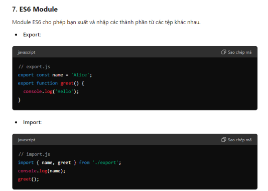

# ES6 Modules Trong JavaScript

ES6 (ECMAScript 2015) đã giới thiệu một cách chính thức để quản lý module trong JavaScript, giúp việc tổ chức và tái sử dụng mã nguồn trở nên dễ dàng hơn. Dưới đây là tổng quan về cách sử dụng ES6 modules.

