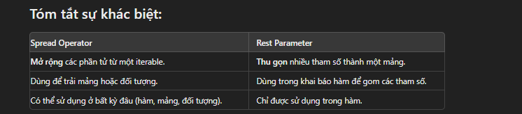

# Destructuring & Rest Parameter & Spread Syntax

## Destructuring

Trích xuất các phần tử từ mảng hoặc thuộc tính từ đối tượng và gắn chúng vào biến

### Destructuring với object

```js
const user = {
  name: 'Duoc',
  age: 24,
  sex: 'male'
}
// Thay vì viết dài dòng như thế này
// const name = user.name
// const age = user.age
// const sex = user.sex
// Dùng Destructuring làm code ngắn gọn hơn nhiều
const { name, age, sex } = user
console.log(name) // Duoc
console.log(age) // 24
console.log(sex) // male
```

### Destructuring với array

```js
const list = [
  1,
  function (a, b) {
    return a + b
  }
]
const [value, func] = list
func(1, 2) // 3
```

## Spread Syntax

Mở rộng hoặc phân tách một mảng  hoặc đối tượng  thành các phần tử  hoặc thuộc tính riêng lẻ

```js
const user = {
  name: 'Duoc',
  age: 24,
  ability: ['coding']
}

// shallow copy
const cloneUser = { ...user }
```

## Rest Parameter


Cho phép bạn truyền một số lượng  không xác định các đối số vào một hàm dưới dạng một mảng

```js
const handle = (a, b, ...c) => {
  return c
}
handle(1, 2, 3, 4, 5, 6) // [3,4,5,6]
```

Kết hợp rest parameter với destructuring

```js
const handle = ({ a, b, ...c }) => {
  return c
}
handle({ a: 1, b: 2, c: 3, d: 4, e: 5 }) // {c: 3, d: 4, e: 5}

```


