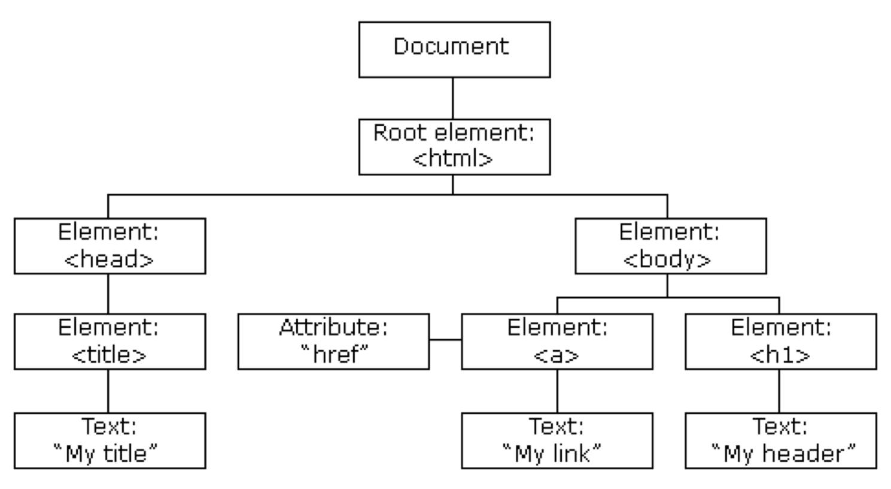

# DOM Trong CSS

## Giới Thiệu Về DOM

**DOM (Document Object Model)** là một mô hình lập trình dành cho tài liệu HTML và XML. Nó định nghĩa cấu trúc logic của tài liệu và cách tài liệu được truy cập và thao tác. Trong DOM, tài liệu được biểu diễn dưới dạng cây của các đối tượng.



## CSS Và DOM

Khi làm việc với CSS và DOM, các nhà phát triển web có thể thao tác các yếu tố của tài liệu một cách động để thay đổi giao diện và trải nghiệm người dùng mà không cần tải lại trang. CSS có thể được áp dụng, chỉnh sửa và thay đổi thông qua JavaScript bằng cách tương tác với DOM.

### Truy Cập Các Phần Tử DOM

Để thay đổi các thuộc tính CSS của một phần tử trong DOM, trước tiên bạn cần truy cập phần tử đó. Điều này được thực hiện bằng cách sử dụng JavaScript.

Các phương thức phổ biến để truy cập phần tử DOM bao gồm:

- `document.getElementById(id)` - Truy cập phần tử dựa trên thuộc tính ID.
- `document.getElementsByClassName(class)` - Truy cập các phần tử dựa trên thuộc tính class.
- `document.querySelector(selector)` - Truy cập phần tử đầu tiên khớp với một CSS selector.
- `document.querySelectorAll(selector)` - Truy cập tất cả các phần tử khớp với một CSS selector.

### Thay Đổi CSS Bằng DOM

Khi đã truy cập vào phần tử, bạn có thể thay đổi các thuộc tính CSS của phần tử đó bằng cách thao tác với thuộc tính `style`. Ví dụ:

```javascript
// Truy cập phần tử bằng ID
const element = document.getElementById('myElement');

// Thay đổi màu nền của phần tử
element.style.backgroundColor = 'blue';

// Thay đổi kích thước phông chữ của phần tử
element.style.fontSize = '20px';
```

## `preventDefault()` và `stopPropagation()` trong JavaScript

### 1. `preventDefault()`
- **Mục đích**: Phương thức này được sử dụng để ngăn chặn hành vi mặc định của một sự kiện nào đó. Ví dụ: ngăn form gửi dữ liệu khi nút submit được nhấn, ngăn liên kết `<a>` chuyển hướng đến URL mới.
- **Cú pháp**: `event.preventDefault();`
- **Ví dụ**:
  ```javascript
  document.getElementById('myLink').addEventListener('click', function(event) {
    event.preventDefault();
    console.log('Liên kết đã bị ngăn chặn');
  });

## `stopPropagation()` trong JavaScript

### Giới thiệu
Phương thức `stopPropagation()` trong JavaScript được sử dụng để dừng sự kiện hiện tại không lan truyền (propagate) lên hoặc xuống các phần tử khác trong DOM. Điều này rất hữu ích khi bạn muốn xử lý sự kiện trên một phần tử cụ thể mà không muốn sự kiện đó ảnh hưởng tới các phần tử cha hoặc con của nó.

## Cú pháp
```javascript
event.stopPropagation();
```